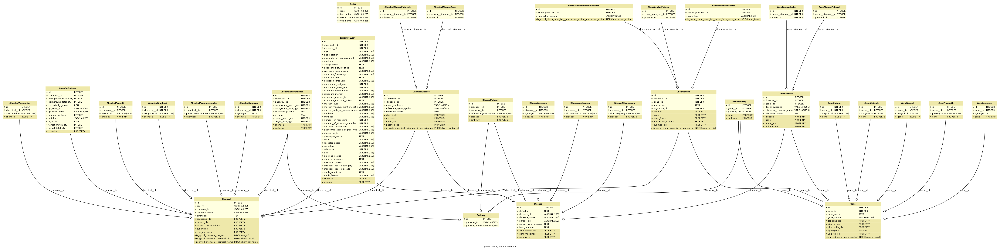

PyCTD Documentation
===================
for version: |version|

.. contents::

Abstract
--------

PyCTD is python software t interface developed by the
`Department of Bioinformatics <https://www.scai.fraunhofer.de/en/business-research-areas/bioinformatics.html>`_
at the Fraunhofer Institute for Algorithms and Scientific Computing
`SCAI <https://www.scai.fraunhofer.de/en.html>`_
to the data provided by the `Comparative Toxicogenomics Database <http://ctdbase.org>`_.

Objectives
----------

Aim of this software project is to provide an programmatic access to locally stored  CTD data and
allow a filtered export
in several formats used in the scientific community. We will focus our software development on the analysis and
extention of biological disease knowledge networks. PyCTD is an ongoing project and
needs improvement. We are happy if you want support our project or start a scientific cooperation with us.

.. _rdbms:

Supported databases
-------------------

`PyCTD` uses `SQLAlchemy <http://sqlalchemy.readthedocs.io>`_ to cover a wide spectrum of RDMSs
(Relational database management system):

1. Firebird
2. Microsoft SQL Server
3. MySQL / `MariaDB <https://mariadb.org/>`_
4. Oracle
5. PostgreSQL
6. SQLite
7. Sybase

System requirements
-------------------

Because of the rich content of CTD `PyCTD` will create more than 230 million rows (04-28-017) with ~14 GiB of disk
storage (depending on the used RDMS). Test were performed on Ubuntu 16.04, 4 x Intel Core i7-6560U CPU @ 2.20Ghz with
16 GiB of RAM. In general PyCTD should work also on other systems like Windows, other Linux distributions or Mac OS.

References and links to CTD
---------------------------
*Latest CTD publication:*

`The Comparative Toxicogenomics Database: update 2017 <https://www.ncbi.nlm.nih.gov/pmc/articles/PMC5210612/>`_;
Nucleic Acids Res. 2017 Jan 4; 45(Database issue): D972–D978.;
Published online 2016 Sep 19. doi:  10.1093/nar/gkw838;
authors: Allan Peter Davis, Cynthia J. Grondin, Robin J. Johnson, Daniela Sciaky, Benjamin L. King, Roy McMorran,
Jolene Wiegers, Thomas C. Wiegers, and Carolyn J. Mattingly;
`PubMed Central <https://www.ncbi.nlm.nih.gov/pubmed/27651457>`_
(`PubReader <https://www.ncbi.nlm.nih.gov/pmc/articles/PMC5210612/?report=reader>`_,
`ePub (beta) <https://www.ncbi.nlm.nih.gov/pmc/articles/PMC5210612/epub/>`_,
`PDF <https://www.ncbi.nlm.nih.gov/pmc/articles/PMC5210612/pdf/gkw838.pdf>`_
)

*Link to data:* `CTD download page <http://ctdbase.org/downloads/>`_

Check the `CTD website <http://ctdbase.org>`_ for more information about data and online tools

Information about CTD
---------------------

Citation from `CTD website (about) <http://ctdbase.org/about/>`_ [04/27/2017]:
 "*CTD is a robust, publicly available database that aims to advance understanding about how environmental exposures
 affect human health. It provides manually curated information about chemical–gene/protein interactions,
 chemical–disease and gene–disease relationships.
 These data are integrated with functional and pathway data to aid in development of hypotheses about the mechanisms
 underlying environmentally influenced diseases.*"

Acknowledgment and contribution to scientific projects
------------------------------------------------------

The software development of PyCTD by Fraunhofer Institute for Algorithms and Scientific Computing (SCAI) is supported
and funded by the `IMI <https://www.imi.europa.eu/>`_
(INNOVATIVE MEDICINES INITIATIVE) projects `AETIONOMY <http://www.aetionomy.eu/>`_  and
`PHAGO <https://www.imi.europa.eu/content/phago>`_. The aim of both projects is the identification of mechnisms in
Alzhiemer's and Parkinson's disease in complex biological `BEL <http://openbel.org/>`_ networks for drug development.

*Software development by:*

* `Christian Ebeling <https://www.scai.fraunhofer.de/de/ueber-uns/mitarbeiter/ebeling.html>`_
* Andrej Kontopez
* Charles Hoyt

The content of CTD and the use of PyCTD in combination with `PyBEL <https://pyctd.readthedocs.io/en/latest/>`_ supports
scientists in the `IMI <https://www.imi.europa.eu/>`_ funded project, `AETIONOMY <http://www.aetionomy.eu/>`_ ,

successfully in the approach to identify potential drugs in complex disease networks with several thousands of
relationships store in `BEL <http://openbel.org/>`_ statements.

Installation
------------

:code:`pyctd` provides a simple API so bioinformaticians and scientists with limited programming knowledge can easily
use it to interface with CTD between chemical–gene/protein interactions, chemical–disease and gene–disease
relationships.

Donload with :code:`git clone https://github.com/cebel/pyctd.git`

Change to folder :code:`cd pyctd`

Install with pip :code:`pip install -e .`

.. toctree::
   :numbered:
   :maxdepth: 2

   overview
   installation
   quick_start

.. toctree::
   :caption: Tutorial
   :name: tutorial

   tutorial

.. toctree::
   :caption: Reference
   :name: reference

   query
   manager

.. toctree::
   :numbered:
   :caption: Project
   :name: project

   roadmap
   technology
   benchmarks

Indices and tables
==================

* :ref:`genindex`
* :ref:`modindex`
* :ref:`search`
