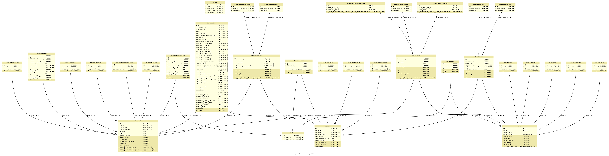

PyCTD Documentation
===================
for version: |version|

:code:`pyctd` is Python software developed by the
`Department of Bioinformatics <https://www.scai.fraunhofer.de/en/business-research-areas/bioinformatics.html>`_
at the Fraunhofer Institute for Algorithms and Scientific Computing (`SCAI <https://www.scai.fraunhofer.de/en.html>`_)
to programmatically access and analyze data provided by the `Comparative Toxicogenomics Database <http://ctdbase.org>`_. For more information about CTD go to section CTD :ref:`ctdref` .

The content of CTD and the use of PyCTD in combination with `PyBEL <https://pyctd.readthedocs.io/en/latest/>`_ facilitates scientists in the `IMI <https://www.imi.europa.eu/>`_ funded projects
`AETIONOMY <http://www.aetionomy.eu/>`_  and `PHAGO <https://www.imi.europa.eu/content/phago>`_
in the identification of potential drug targets in complex disease networks, which contain several thousands of
relationships encoded as `BEL <http://openbel.org/>`_ statements.

The main aim of this software is to provide a programmatic access to locally stored CTD data and
allow a filtered export in several formats used in the scientific community. 
We also focus our software development on the analysis and extension of biological disease knowledge networks.
PyCTD is an ongoing project and needs further development as well as improvement. Please contact us, if you would like to support PyCTD or are interested in a scientific collaboration.

**Fig. 1**: ER model of pyctd database

- supported by `IMI <https://www.imi.europa.eu/>`_, `AETIONOMY <http://www.aetionomy.eu/>`_, `PHAGO <https://www.imi.europa.eu/content/phago>`_.

.. image:: _static/logos/imi-logo.png
   :width: 150 px
   :target: pageapplet/index.html

.. image:: _static/logos/aetionomy-logo.png
   :width: 150 px
   :target: pageapplet/index.html

.. toctree::
   :maxdepth: 2

   installation
   quick_start
   ctd

.. toctree::
   :caption: Reference
   :name: reference

   query
   manager

.. toctree::
   :caption: Project
   :name: project

   benchmarks
   roadmap
   technology

Acknowledgment and contribution to scientific projects
------------------------------------------------------

*Software development by:*

* `Christian Ebeling <https://www.scai.fraunhofer.de/de/ueber-uns/mitarbeiter/ebeling.html>`_
* Andrej Kontopez
* Charles Hoyt

The software development of PyCTD at Fraunhofer Institute for Algorithms and Scientific Computing (SCAI) is supported
and funded by the `IMI <https://www.imi.europa.eu/>`_
(INNOVATIVE MEDICINES INITIATIVE) projects `AETIONOMY <http://www.aetionomy.eu/>`_  and
`PHAGO <https://www.imi.europa.eu/content/phago>`_. The aim of both projects is the identification of mechanisms in
Alzheimer's and Parkinson's disease for drug development through creation and analysis of complex biological `BEL <http://openbel.org/>`_ networks.

Indices and Tables
------------------

* :ref:`genindex`
* :ref:`modindex`
* :ref:`search`
