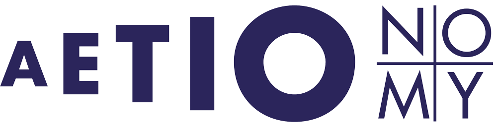

PyCTD Documentation
===================
for version: |version|

:code:`pyctd` is python software interface developed by the
`Department of Bioinformatics <https://www.scai.fraunhofer.de/en/business-research-areas/bioinformatics.html>`_
at the Fraunhofer Institute for Algorithms and Scientific Computing
`SCAI <https://www.scai.fraunhofer.de/en.html>`_
to the data provided by the `Comparative Toxicogenomics Database <http://ctdbase.org>`_. For more in for information
about CTD go to section CTD :ref:`ctdref` .

The content of CTD and the use of PyCTD in combination with `PyBEL <https://pyctd.readthedocs.io/en/latest/>`_ supports
successfully scientists in the `IMI <https://www.imi.europa.eu/>`_ funded projects
`AETIONOMY <http://www.aetionomy.eu/>`_  and `PHAGO <https://www.imi.europa.eu/content/phago>`_
in the identification of potential drugs in complex disease networks with several thousands of
relationships compiled from `BEL <http://openbel.org/>`_ statements.

Aim of this software project is to provide an programmatic access to locally stored  CTD data and
allow a filtered export in several formats used in the scientific community.
We will focus our software development on the analysis and extention of biological disease knowledge networks.
PyCTD is an ongoing project and needs improvement. We are happy if you want support our project or start
a scientific cooperation with us.

.. figure:: _static/models/all.png
   :target: _images/all.png
   :alt: ER model of pyctd database

**Fig. 1**: ER model of pyctd database

- supported by `IMI <https://www.imi.europa.eu/>`_, `AETIONOMY <http://www.aetionomy.eu/>`_, `PHAGO <https://www.imi.europa.eu/content/phago>`_.

.. image:: _static/logos/imi-logo.png
   :width: 150 px
   :target: pageapplet/index.html

.. image:: _static/logos/scai-logo.svg
   :width: 150 px
   :target: pageapplet/index.html

.. toctree::
   :numbered:
   :maxdepth: 2

   installation
   quick_start
   tutorial
   ctd
   benchmarks

.. toctree::
   :caption: Reference
   :name: reference

   query
   manager

.. toctree::
   :numbered:
   :caption: Project
   :name: project

   roadmap
   technology

Objectives
----------

Acknowledgment and contribution to scientific projects
------------------------------------------------------

*Software development by:*

* `Christian Ebeling <https://www.scai.fraunhofer.de/de/ueber-uns/mitarbeiter/ebeling.html>`_
* Andrej Kontopez
* Charles Hoyt

The software development of PyCTD by Fraunhofer Institute for Algorithms and Scientific Computing (SCAI) is supported
and funded by the `IMI <https://www.imi.europa.eu/>`_
(INNOVATIVE MEDICINES INITIATIVE) projects `AETIONOMY <http://www.aetionomy.eu/>`_  and
`PHAGO <https://www.imi.europa.eu/content/phago>`_. The aim of both projects is the identification of mechnisms in
Alzhiemer's and Parkinson's disease in complex biological `BEL <http://openbel.org/>`_ networks for drug development.

Indices and Tables
------------------

* :ref:`genindex`
* :ref:`modindex`
* :ref:`search`